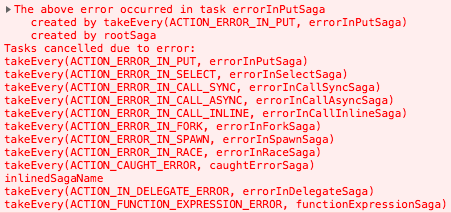
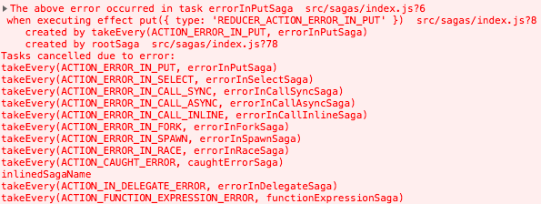

# 故障排查

### 添加 saga 后应用冻结

确保你在生成器函数中 `yield` 了效果。

考虑以下示例：

```js
import { take } from 'redux-saga/effects'

function* logActions() {
  while (true) {
    const action = take() // 错误
    console.log(action)
  }
}
```

它会将应用程序放入无限循环，因为 `take()` 只创建效果的描述。除非你为中间件执行 `yield`，否则 `while` 循环将像常规 `while` 循环一样运行，并冻结你的应用程序。

添加 `yield` 将暂停生成器并将控制权返回给 Redux Saga 中间件，该中间件将执行效果。在 `take()` 的情况下，Redux Saga 将等待下一个匹配模式的动作，然后才会恢复生成器。

要修复上面的示例，`yield` 由 `take()` 返回的效果：

```js
import { take } from 'redux-saga/effects'

function* logActions() {
  while (true) {
    const action = yield take() // 正确
    console.log(action)
  }
}
```

### 我的 Saga 缺少派发的动作

确保 Saga 没有在某些效果上被阻塞。当 Saga 在等待效果解决时，它将无法接收派发的动作，直到效果被解决。

例如，考虑这个例子

```javascript
function* watchRequestActions() {
  while (true) {
    const { url, params } = yield take('REQUEST')
    yield call(handleRequestAction, url, params) // Saga 将在此处阻塞
  }
}

function* handleRequestAction(url, params) {
  const response = yield call(someRemoteApi, url, params)
  yield put(someAction(response))
}
```

当 `watchRequestActions` 执行 `yield call(handleRequestAction, url, params)` 时，它将等待 `handleRequestAction` 结束并返回，然后才继续下一个 `yield take`。例如，假设我们有这样的事件序列

```
UI                     watchRequestActions             handleRequestAction
---------------------------------------------------------------------------
.......................take('REQUEST').......................................
dispatch(REQUEST)......call(handleRequestAction).......call(someRemoteApi)... 等待服务器响应
.............................................................................
.............................................................................
dispatch(REQUEST)............................................................ 动作丢失!!
.............................................................................
.............................................................................
.......................................................put(someAction).......
.......................take('REQUEST')....................................... saga 恢复
```

如上所示，当 Saga 在**阻塞调用**上被阻塞时，它将错过所有在此期间派发的动作。

为了避免阻塞 Saga，你可以使用 `fork` 而不是 `call` 来进行**非阻塞调用**

```javascript
function* watchRequestActions() {
  while (true) {
    const { url, params } = yield take('REQUEST')
    yield fork(handleRequestAction, url, params) // Saga 将立即恢复
  }
}
```

### 错误冒泡到根 saga 的错误堆栈不可读

saga 中的任务本质上是异步的，所以我们必须做一些额外的工作来显示 "saga 堆栈"，就像它是一系列同步调用的链。所以从 `redux-saga@v1` 开始，当错误冒泡到根 saga 时，库会构建那个 "saga 堆栈" 并将其作为 `onError` 回调的第二个参数的属性 `sagaStack: string` 传递（也参见 [中间件选项](https://redux-saga.js.org/docs/api/index.html#createsagamiddlewareoptions)），所以你可以将它发送到你的错误跟踪系统或做其他额外的工作。

结果，你可以在控制台中看到类似这样的内容。



如果你想在**开发目的**中有那些带有文件名和行号的 "saga 堆栈"，你可以添加 [babel-plugin](https://www.npmjs.com/package/babel-plugin-redux-saga)，它允许你有增强的信息。
文档可在[这里](https://github.com/redux-saga/redux-saga/tree/main/packages/babel-plugin-redux-saga)找到。
关于 babel-plugin 使用示例，请查看[此示例](https://github.com/redux-saga/redux-saga/tree/main/examples/error-demo)。

添加 `babel-plugin-redux-saga` 后，相同的输出看起来像



注意：[它也适用于测试](https://github.com/redux-saga/redux-saga/blob/main/examples/error-demo/test/sagas.js)，只需确保你（或你的运行器）通过 `sagaMiddleware` 运行 saga。

```javascript
import { delay } from 'redux-saga/effects'

function* updateApi(data) {
  while (true) {
    try {
      const apiResponse = yield call(apiRequest, { data })
      return apiResponse
    } catch (error) {
      yield put({
        type: 'UPDATE_RETRY',
        error,
      })
      yield delay(2000)
    }
  }
}

function* updateResource({ data }) {
  const apiResponse = yield call(updateApi, data)
  yield put({
    type: 'UPDATE_SUCCESS',
    payload: apiResponse.body,
  })
}

export function* watchUpdateResource() {
  yield takeLatest('UPDATE_START', updateResource)
}
```

## 撤销

撤销功能尊重用户，允许操作首先顺利进行，然后再假设他们不知道自己在做什么([链接](https://goodui.org/#8))。
[redux 文档](https://redux.js.org/recipes/implementing-undo-history#understanding-undo-history)描述了一种基于修改 reducer 来包含 `past`、`present` 和 `future` 状态的撤销实现方式。甚至有一个库 [redux-undo](https://github.com/omnidan/redux-undo) 为开发者创建了一个高阶 reducer 来完成大部分繁重的工作。

然而，这种方法带来了开销，因为它存储了应用程序的前一个状态的引用。

使用 redux-saga 的 `delay` 和 `race`，我们可以实现一个基本的、一次性的撤销，而无需增强我们的 reducer 或存储前一个状态。

```javascript
import { take, put, call, spawn, race, delay } from 'redux-saga/effects'
import { updateThreadApi, actions } from 'somewhere'

function* onArchive(action) {
  const { threadId } = action
  const undoId = `UNDO_ARCHIVE_${threadId}`

  const thread = { id: threadId, archived: true }

  // 显示撤销 UI 元素，并提供一个键来通信
  yield put(actions.showUndo(undoId))

  // 乐观地将线程标记为 `archived`
  yield put(actions.updateThread(thread))

  // 允许用户在 5 秒内执行撤销。
  // 5 秒后，'archive' 将是竞态条件的赢家
  const { undo, archive } = yield race({
    undo: take(action => action.type === 'UNDO' && action.undoId === undoId),
    archive: delay(5000),
  })

  // 隐藏撤销 UI 元素，竞态条件有了答案
  yield put(actions.hideUndo(undoId))

  if (undo) {
    // 将线程恢复到前一个状态
    yield put(actions.updateThread({ id: threadId, archived: false }))
  } else if (archive) {
    // 调用 API 来远程应用更改
    yield call(updateThreadApi, thread)
  }
}

function* main() {
  while (true) {
    // 等待一个 ARCHIVE_THREAD 发生
    const action = yield take('ARCHIVE_THREAD')
    // 使用 spawn 以非阻塞方式执行 onArchive，这也防止了当主 saga 被取消时取消。
    // 这有助于我们在服务器和客户端之间保持状态同步
    yield spawn(onArchive, action)
  }
}
```

## 批处理操作

`redux` 不支持一次派发多个操作并只调用一次 reducer 的能力。这对性能有影响，而且需要顺序派发多个操作的操作性也不好。

相反，我们看看第三方库，[redux-batched-actions](https://github.com/tshelburne/redux-batched-actions)。这是一个简单的 reducer 和操作，允许最终开发者派发多个操作，并且只让你的 reducer 被调用一次。

如果你有一个需要同时派发许多操作的代码库，我们建议使用这个配方。

```javascript
import { configureStore } from '@reduxjs/toolkit';
import createSagaMiddleware, { stdChannel } from 'redux-saga';
import { enableBatching, BATCH } from 'redux-batched-actions';

// 你的根 reducer
import { rootReducer } from './reducer';
// 你的根 saga
import { rootSaga } from './saga';

const channel = stdChannel();
const rawPut = channel.put;
channel.put = (action: ActionWithPayload<any>) => {
  if (action.type === BATCH) {
    action.payload.forEach(rawPut);
    return;
  }
  rawPut(action);
};
const sagaMiddleware = createSagaMiddleware({ channel });

const reducer = enableBatching(rootReducer);
// https://redux-toolkit.js.org/api/configureStore
const store = configureStore({
  reducer: rootReducer,
  middleware: [sagaMiddleware],
});
sagaMiddleware.run(rootSaga);
```
